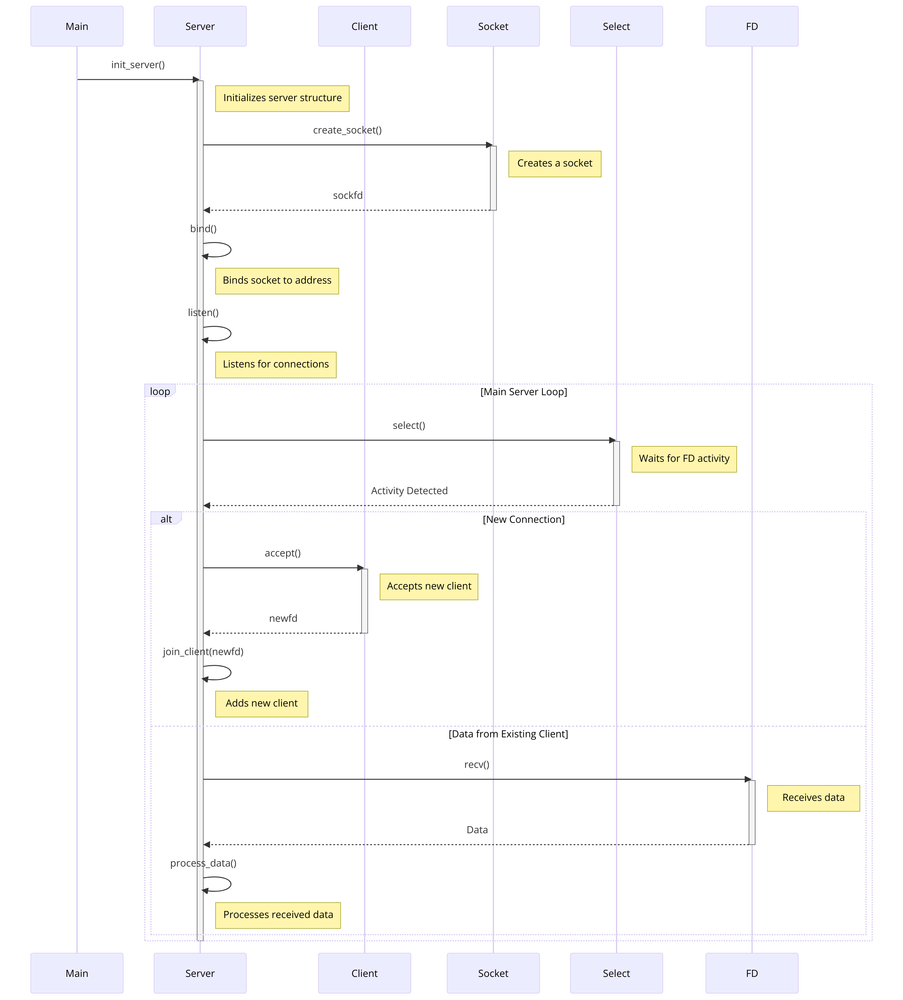

# Exam rank 06

---

# 📡 Assignment Name: mini_serv



### 📁 Expected Files:
- `mini_serv.c`

### ✅ Allowed Functions:
- `write`, `close`, `select`, `socket`, `accept`, `listen`, `send`, `recv`, `bind`, `strstr`, `malloc`, `realloc`, `free`, `calloc`, `bzero`, `atoi`, `sprintf`, `strlen`, `exit`, `strcpy`, `strcat`, `memset`

---

## 🎯 Assignment Brief:

👨‍💻 **Task:**
- Write a program that listens for clients to connect on a specific port at `127.0.0.1` and allows clients to communicate with each other.

🚪 **Port Binding:**
- The program should take the port to bind to as the first argument.
- If no argument is provided, display `"Wrong number of arguments\n"` on stderr and exit with status `1`.

🚨 **Error Handling:**
- On a system call error before accepting connections, display `"Fatal error\n"` on stderr and exit with status `1`.
- On memory allocation failure, display `"Fatal error\n"` on stderr and exit with status `1`.

🔗 **Connection Requirements:**
- The program must be non-blocking. However, clients can be slow to read messages - do not disconnect them for this reason.
- The program must only listen to `127.0.0.1`.
- File descriptors (fd) should be set up such that 'recv' or 'send' will block if `select` isn't called before them, but will not block otherwise.

👥 **Client Interaction:**
- Assign IDs to clients sequentially, starting from `0`.
- Notify all clients when a new client connects: `"server: client %d just arrived\n"`.
- Clients can send messages containing only printable characters and `\n`.
- Relay received messages to all clients, prefixed with `"client %d: "`.

🚪 **Client Disconnection:**
- Notify all clients when a client disconnects: `"server: client %d just left\n"`.

🚫 **Constraints:**
- No memory or file descriptor leaks.
- Do not use `#define` preprocessor directives.

---

### 🛠️ Additional Information:
- A `main.c` file is provided with a server template and potentially useful functions (but it may contain forbidden elements for your final program).
- Expect longer evaluation times.
- Use `nc` (netcat) for testing your program.

### 💡 Hints:
- To set non-blocking mode for testing, you can use `fcntl(fd, F_SETFL, O_NONBLOCK)`, but ensure to use `select` and avoid checking `EAGAIN` (refer to `man 2 send`).

----

# Vim Basic Usage Guide

## Common Vim Commands

- ✏️ `i`: Enter insert mode before the cursor.
- ✏️ `I`: Enter insert mode at the beginning of the line.
- ✏️ `a`: Enter insert mode after the cursor.
- ✏️ `A`: Enter insert mode at the end of the line.
- ✂️ `x`: Delete the character under the cursor.
- ✂️ `dd`: Delete the current line.
- 💾 `:w`: Save the file.
- 🚪 `:q`: Quit Vim.
- 🚪 `:q!`: Force quit without saving.
- 💾 `:wq` or `:x`: Save and exit.
- 💾 `ZZ`: Save and exit.
- 📋 `yy`: Yank (copy) the current line.
- 📋 `p`: Paste the yanked text.
- ↩️ `u`: Undo the last change.
- ↪️ `Ctrl + r`: Redo the last undo.
- 📂 `:e <file>`: Edit a different file.
- 📂 `:sp <file>`: Split the screen to edit a different file.

## Vim Settings

- 📊 `set number`: Display line numbers.
- 🖱️ `set mouse=a`: Enable mouse support.
- 🎨 `syntax on`: Enable syntax highlighting.
- 📝 `set autoindent`: Enable auto-indentation.

### Configuring Vim Settings by Default

To configure Vim settings by default, you can create a `.vimrc` file in your home directory:

1. Open a terminal and navigate to your home directory:

   ```bash
   cd ~
   ```

2. Create or edit the `.vimrc` file:

   ```bash
   nano .vimrc  # Create and edit .vimrc using the nano editor
   ```

   or

   ```bash
   vim .vimrc   # Create and edit .vimrc using the Vim editor
   ```

3. Add the Vim settings you want to apply by default to your `.vimrc` file. For example, to set line numbers and syntax highlighting:

   ```vim
   " Enable line numbers
   set number

   " Enable syntax highlighting
   syntax on
   ```

4. Save and exit the text editor.

5. Restart Vim or open a new terminal, and the settings in your `.vimrc` will be applied by default whenever you use Vim.

These are additional basic Vim commands and settings, and you can configure your preferred settings to be applied by default using a `.vimrc` file.
